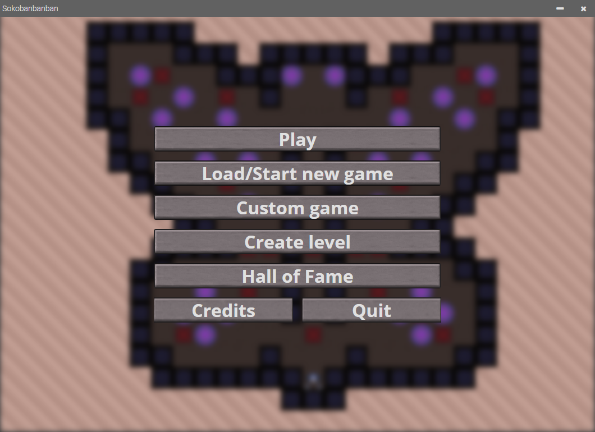

# Sokobanbanban

*"Sokoban" Project for Motorola Science Cup 2020*
User Documentation

The Technical Documentation is in the [TECH-DOC-EN.md](./TECH-DOC-EN.md) file.  
Polska wersja Dokumentacji Użytkownika jest w pliku [README.md](./README.md).  

## 1. Newest stable version

<u style="font-size: 2.5rem">3.1.1</u>

## 2. Zakon Technomantów

* Grand Master (Team Leader): **Iwo Strzeboński**
* And other Brethren (Members):
  * **Igor Kaliciński**
  * **Jan Krzemień**
  * **Zbyszko Sobecki**
  * **Wojciech Orłowski**

## 3. Authors

* **Iwo Strzeboński**:
  * GUI Design
  * Level Modes
  * Map Difficulty
  * Documentation
* **Igor Kaliciński**:
  * Level Editor
  * Hall of Fame
  * Save Slots

## 4. License

[WTFPL by Sam Hocevar](./LICENSE)

## 5. Credits

* **Laura Wheeler** - author of the *Sokoban Junior 1* game, from which maps in this game are from

## 6. Preparing the environment to work

1. Install [Node.js](https://nodejs.org/en/download/)
2. Download required packages using:

```cmd
npm install
```

## 7. Working on the source code

To start the program, you need to use that command in the command line:

```cmd
npm start
```

## 8. Building the Project

To build the project you should use the ElectronForge package, which is also downloaded as a required dependency.

```cmd
npx @electron-forge/cli import
npm run make
```

Building the Project is **NOT** required in order to launch it!

## 9. Playing the Game

### 1. In-game movement


* Buttons:
  * `Save` zapisuje rozgrywkę (dostępny wyłącznie w II Module)  

  * `Surrender` poddaje rozgrywkę i zapisuje wynik do Hali Sław
  (dostępny wyłącznie w II Module)  

  * `Back` cofa do poprzedniej strony  

  * `Undo Last Move` cofa ostatni ruch

  * `Restart` ustawia gracza i skrzynie na pozycjach pierwotnych

* Keyboard events:
  * `W` lub `Strzałka do góry` porusza gracza do góry

  * `A` lub `Strzałka w lewo` porusza gracza w lewo

  * `S` lub `Strzałka w dół` porusza gracza w dół

  * `D` lub `Strzałka w prawo` porusza gracza w prawo

  * `R` ustawia gracza i skrzynie na pozycjach pierwotnych

### 2. Creating levels

### 3. Main Menu



* Przycisk oznaczony pojedynczą poziomą kreską służy do minimalizowania programu.  

* Przycisk oznaczony symbolem krzyżyka służy do zamykania programu.  

* Przycisk `Play` służy do uruchamiania Modułu I -
map podzielonych na poziomy trudności.  

* Przycisk `Load/Start new game` służy do uruchamiania Modułu II -
map o rosnącym poziomie trudności.  

* Przycisk `Custom game` służy do uruchamiania Modułu III -
mapy stworzonej w Edytorze Map.  

* Przycisk `Create level` służy do uruchamiania Modułu III - edytora map.  

* Przycisk `Hall of Fame` służy do uruchamiania Modułu II -
sprawdzania listy wyników trybu o rosnącym poziomie trudności.

* Przycisk `Credits` przenosi do strony z informacjami
o Autorach oraz podziękowaniach.  

* Przycisk `Quit` zamyka grę.  

### 4. Module I - Difficulty Levels


* Przycisk oznaczony symbolem domu służy do powrotu na Stronę Główną.  

* Przycisk `Back` cofa do poprzedniej strony.  

* Przycisk `Easy` uruchamia losową Łatwą mapę.  


* Przycisk `Medium` uruchamia losową Średnio Trudną mapę.  


* Przycisk `Hard` uruchamia losową Trudną mapę.  


### 5. Module II - Ascending Mode


* Przyciski opisane kolejno `Save 1`, `Save 2` i `Save 3` to kolejne zapisy gry.
Gracz ma do dyspozycji wyłącznie trzy miejsca na zapisy.  

  Naciśnięcie dowolnego przycisku zapisu uruchamia grę na mapie,
  która jest w danym zapisie. Jeśli nie ma pliku zapisu, to jest on tworzony
  i jest do niego wczytywana pierwsza mapa Trybu.  


