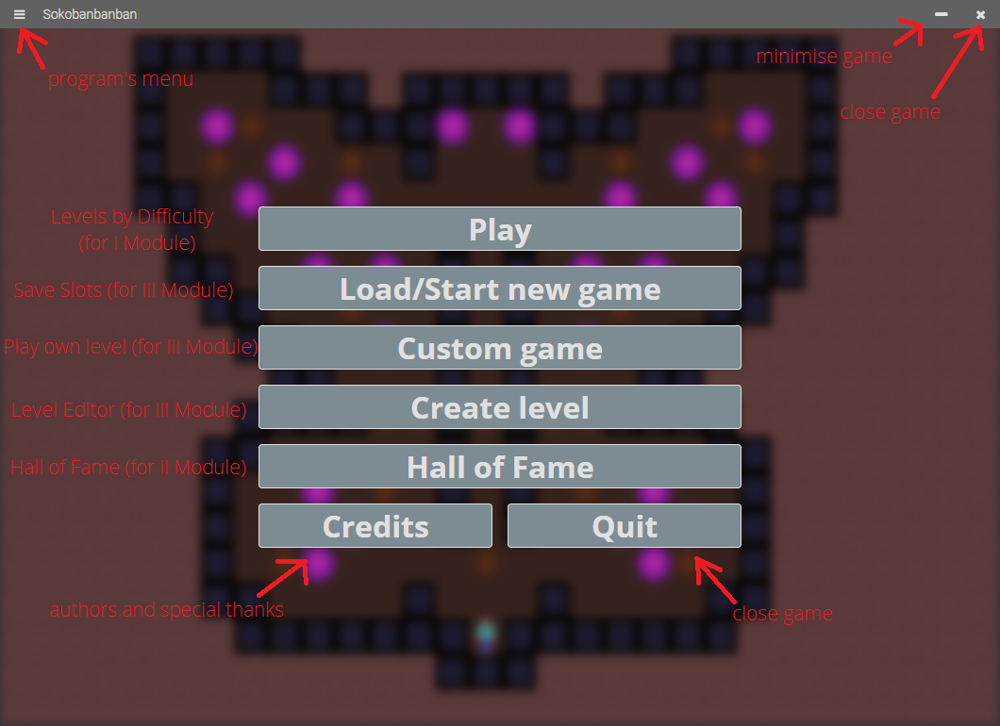

# Sokobanbanban

*Projekt "Sokoban" na Motorola Science Cup 2020*  
*"Sokoban" Project for Motorola Science Cup 2020*

Dokumentacja Użytkownika  
User Documentation

Dokumentacja Techniczna jest w pliku /
Technical Documentation is in
[TECH-DOC.md](./TECH-DOC.md)

## 1. Najnowsza stabilna wersja / Newest stable version: <u style="font-size: 2.5rem">3.0.0</u>

## 2. Zakon Technomantów

* Wielki Mistrz (Kapitan) / Grand Master (Team Leader): **Iwo Strzeboński**
* i pozostali Bracia (Członkowie) / and other Brethren (Members):
  * **Igor Kaliciński**
  * **Jan Krzemień**
  * **Zbyszko Sobecki**
  * **Wojciech Orłowski**

## 3. Autorzy / Authors

* **Iwo Strzeboński**:
  * Projektowanie wyglądu interfejsu graficznego / GUI Design
  * Różne tryby / Level Modes
  * Poziomy trudności map / Map Difficulty
  * Dokumentacja / Documentation
* **Igor Kaliciński**:
  * Edytor poziomów / Level Editor
  * Hala Sław / Hall of Fame
  * Zapisy gier / Save Slots

## 4. Licencja

[WTFPL by Sam Hocevar](./LICENSE)

## 5. Podziękowania / Credits

* **Laura Wheeler** -
twórczyni gry *Sokoban Junior 1*, skąd pochodzą mapy /
author of the *Sokoban Junior 1* game, from which maps in this game are from

## 6. Przygotowywanie środowiska do pracy / Preparing the environment to work

1. Zainstaluj / Install [Node.js]
2. Pobierz wymagane pakiety za pomocą polecenia: / Download required packages using:

```cmd
npm install
```

## 7. Praca na kodzie źródłowym / Working on the source code

Aby uruchomić program, należy w konsoli wpisać polecenie: / To start the program, you need to use that command in the command line:

```cmd
npm start
```

## 8. Budowanie Projektu / Building the Project

Do zbudowania projektu należy użyć pakietu ElectronForge, który także jest pobierany jako wymagany pakiet.  
To build the project you should use the ElectronForge package, which is also downloaded as a required dependency.

```cmd
npx @electron-forge/cli import
npm run make
```

Zbudowanie Projektu **NIE** jest wymagane do uruchomienia go!  
Building the Project is **NOT** required in order to launch it!

[Node.js]:https://nodejs.org/en/download/

## 9. Rozgrywka / Game

### 1. Główne Menu / Main Menu


