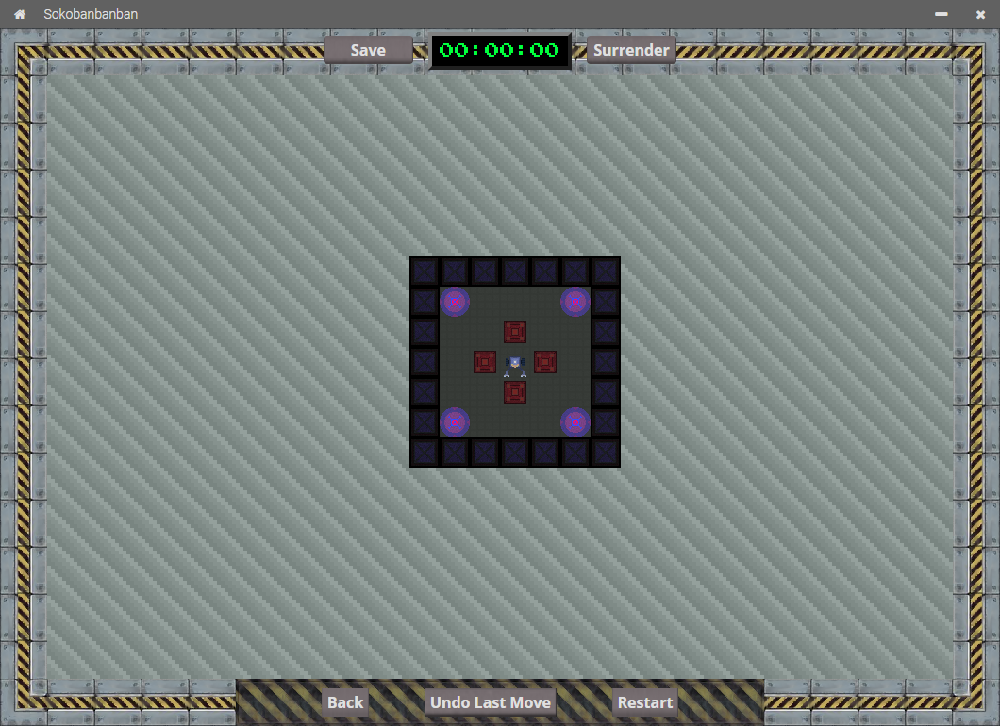
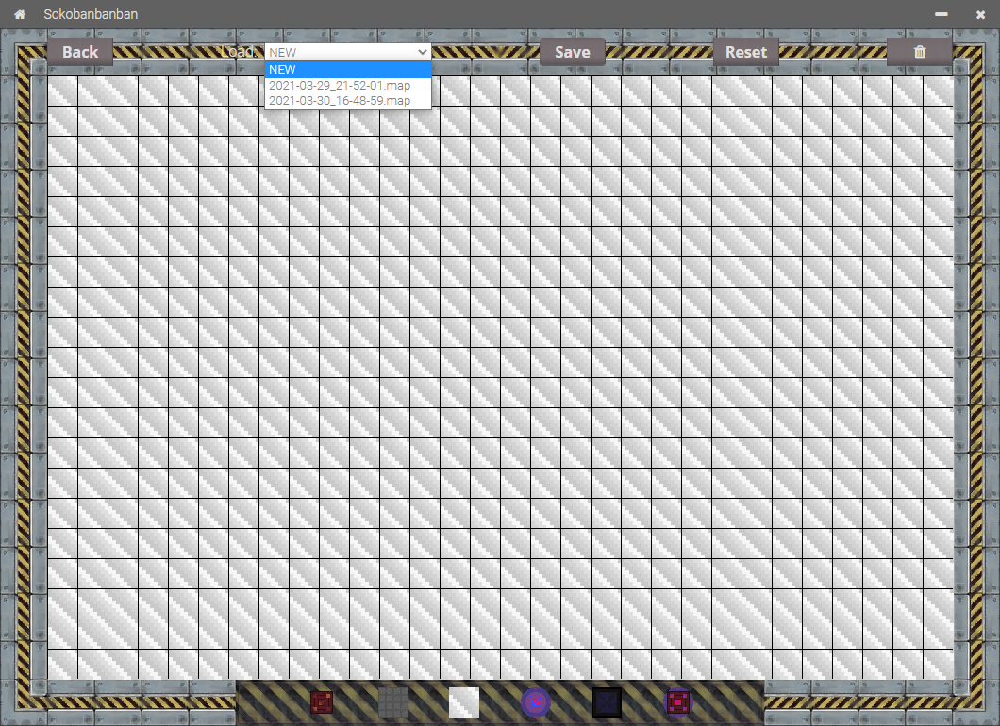
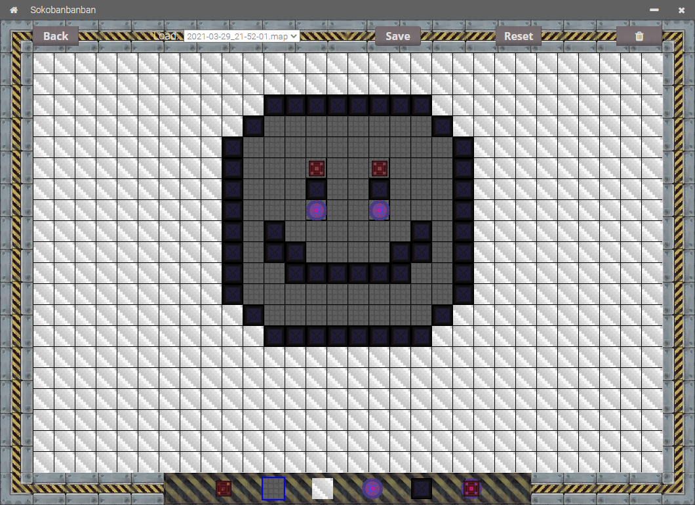
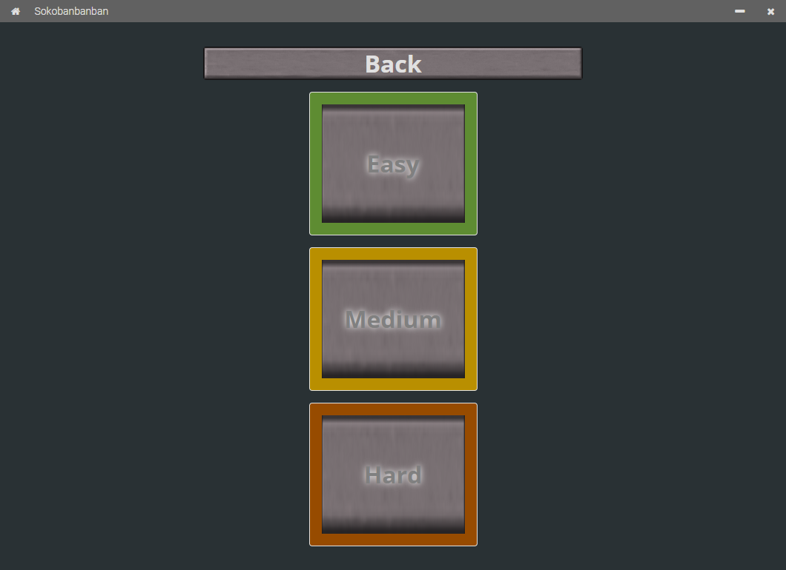
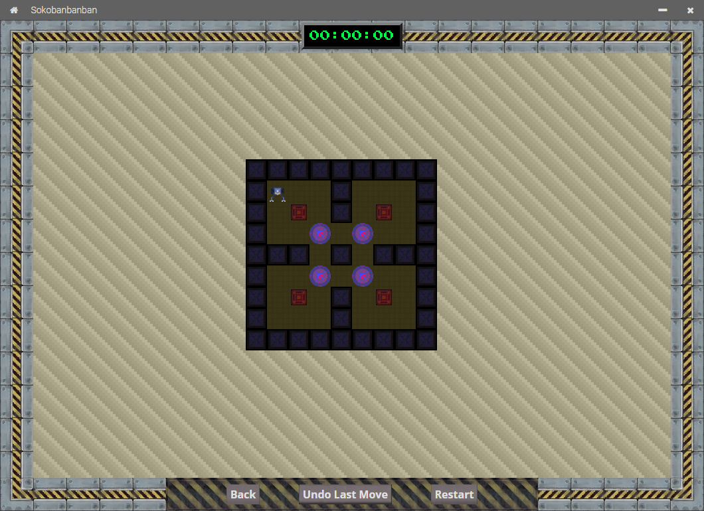
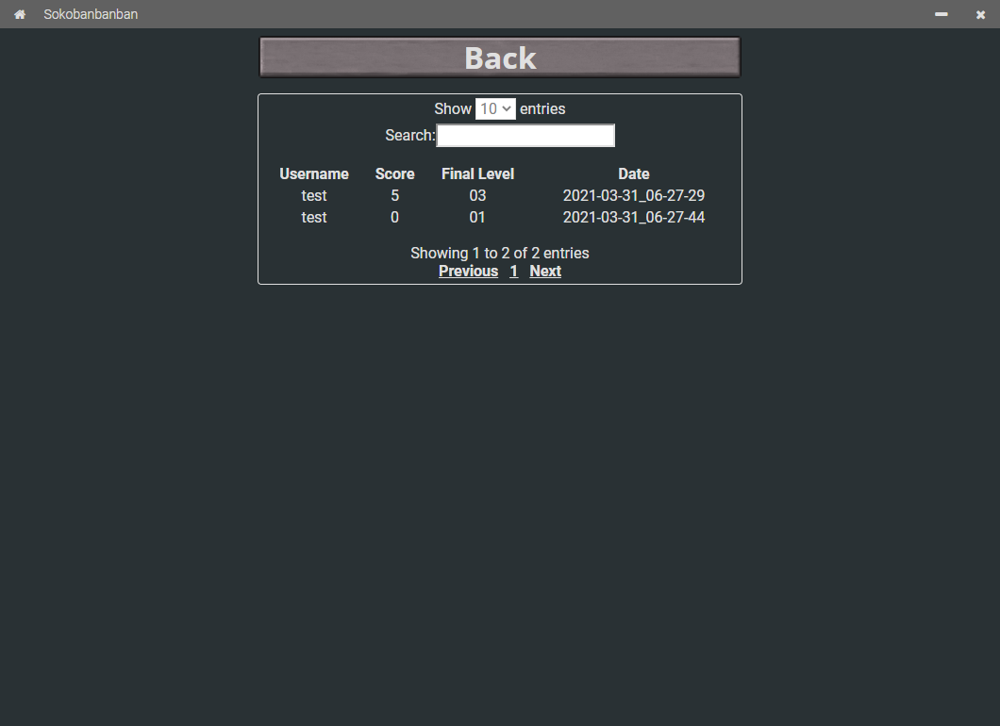
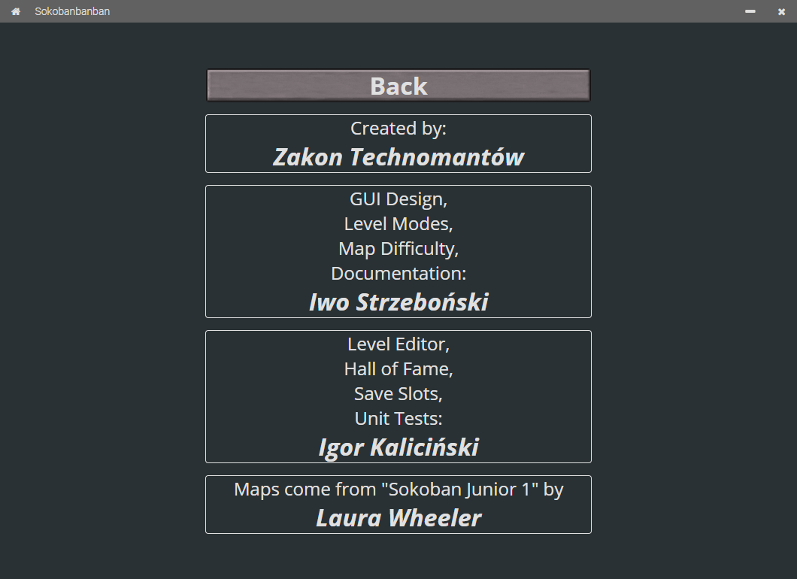

# Sokobanbanban

*Projekt "Sokoban" na Motorola Science Cup 2020*  
Dokumentacja Użytkownika  

Dokumentacja Techniczna jest w pliku [TECH-DOC-PL.md](./TECH-DOC-PL.md).  
English version of the User Documentation is in the [README-EN.md](./README-EN.md) file. [Work in Progress]  

## 1. Najnowsza stabilna wersja

<u style="font-size: 2.5rem">3.2.2</u>

## 2. Spis Treści

* [Sokobanbanban](#sokobanbanban)
  * [1. Najnowsza stabilna wersja](#1-najnowsza-stabilna-wersja)
  * [2. Spis Treści](#2-spis-treści)
  * [3. Zakon Technomantów](#3-zakon-technomantów)
  * [4. Autorzy](#4-autorzy)
  * [5. Licencja](#5-licencja)
  * [6. Podziękowania](#6-podziękowania)
  * [7. Przygotowywanie środowiska do pracy](#7-przygotowywanie-środowiska-do-pracy)
  * [8. Praca na kodzie źródłowym](#8-praca-na-kodzie-źródłowym)
  * [9. Budowanie Projektu](#9-budowanie-projektu)
  * [10. Rozgrywka](#10-rozgrywka)
    * [a. Poruszanie się w grze](#a-poruszanie-się-w-grze)
    * [b. Moduł III - Tworzenie map](#b-moduł-iii---tworzenie-map)
    * [c. Menu Główne](#c-menu-główne)
    * [d. Moduł I - Poziomy Trudności](#d-moduł-i---poziomy-trudności)
    * [e. Moduł II - Rosnący Poziom Trudności](#e-moduł-ii---rosnący-poziom-trudności)
    * [f. Moduł III - Gra na własnym poziomie](#f-moduł-iii---gra-na-własnym-poziomie)
    * [g. Moduł II - Hala Sław](#g-moduł-ii---hala-sław)
    * [h. Podziękowania](#h-podziękowania)

## 3. Zakon Technomantów

* Wielki Mistrz (Kapitan Drużyny): **Iwo Strzeboński**
* I pozostali Bracia (Członkowie):
  * **Igor Kaliciński**
  * **Jan Krzemień**
  * **Zbyszko Sobecki**
  * **Wojciech Orłowski**

## 4. Autorzy

* **Iwo Strzeboński**:
  * Projektowanie wyglądu interfejsu graficznego
  * Różne tryby
  * Poziomy trudności map
  * Dokumentacja
* **Igor Kaliciński**:
  * Edytor poziomów
  * Hala Sław
  * Zapisy gier

## 5. Licencja

[WTFPL by Sam Hocevar](./LICENSE)

## 6. Podziękowania

* **Laura Wheeler** - twórczyni gry *Sokoban Junior 1*, skąd pochodzą mapy

## 7. Przygotowywanie środowiska do pracy

1. Zainstaluj [Node.js](https://nodejs.org/en/download/)
2. Pobierz wymagane pakiety za pomocą polecenia:  

```cmd
npm install
```

## 8. Praca na kodzie źródłowym

Aby uruchomić program, należy w konsoli wpisać polecenie:

```cmd
npm start
```

## 9. Budowanie Projektu

Do zbudowania projektu należy użyć pakietu ElectronForge,
który także jest pobierany jako wymagany pakiet.  

```cmd
npx @electron-forge/cli import
npm run package
```

Zbudowanie Projektu **NIE** jest wymagane do uruchomienia go!  

## 10. Rozgrywka

### a. Poruszanie się w grze



* `Magazynier` (`Gracz`):  
  
  
  
    

  `Magazynier` może się poruszać po polach `Podłoga`
  
  oraz `Powietrze`
  .  
  Nie potrafi jednak przechodzić przez pole `Ściany`
  .  
  Niestety `Skrzynie`
  
  są zbyt ciężkie, żeby mógł je unieść, więc musi je pchać po `Podłodze`.  
  Może je przesuwać wtedy i tylko wtedy, gdy za nią jest pole `Podłoga`
  lub pole `Płytka`
  ,
  o ile bezpośrednio za tą `Skrzynią` nie ma innej `Skrzyni`.  

* Przyciski:
  * `Save` zapisuje rozgrywkę (dostępny wyłącznie w II Module).  
  * `Surrender` poddaje rozgrywkę i zapisuje wynik do Hali Sław
  (dostępny wyłącznie w II Module).  
  * `Back` cofa do poprzedniej strony.  
  * `Undo Last Move` cofa ostatni ruch.  
  * `Restart` ustawia gracza i skrzynie na pozycjach pierwotnych.  

* Obsługa klawiatury:
  * `W` lub `Strzałka do góry` porusza gracza do góry.  
  * `A` lub `Strzałka w lewo` porusza gracza w lewo.  
  * `S` lub `Strzałka w dół` porusza gracza w dół.  
  * `D` lub `Strzałka w prawo` porusza gracza w prawo.  
  * `R` ustawia gracza i skrzynie na pozycjach pierwotnych.  

### b. Moduł III - Tworzenie map



* Przyciski:  
  * `Back` cofa do poprzedniej strony.  
  * `Load` pozwala na wybranie uprzednio utworzonej  mapy i jej edycję.  
    

  * `Save` zapisuje utworzoną mapę.  
  Jeśli w polu wyboru `Load` jest wybrana nowa mapa (`NEW`),
  to zostanie utworzona nowa mapa;
  w innym wypadku mapa o wybranej nazwie zostanie nadpisana.  
  * `Reset` odświeża stronę, usuwając wszystkie narysowane pola.  
  * Przycisk oznaczony symbolem `kosza na śmieci` usuwa wybraną mapę.  

* Elementy mapy:
  * `Skrzynia`:  
    
  Interaktywny obiekt, który może być przesuwany przez `Magazyniera`
  .  

  * `Podłoga`:  
    
  Statyczny element mapy, po którym może chodzić `Magazynier`
  
  oraz po którym mogą być przesuwane `Skrzynie`
  .  

  * `Trawa`:  
    
  Tło mapy.

  * `Płytka`:  
    
  Interaktywny obiekt mapy, na który `Magazynier`
  
  ma przesunąć `Skrzynię`
  .  

  * `Ściana`:  
    
  Statyczny element mapy blokujący ruch `Magazyniera`
  
  oraz przesuwanie `Skrzyń`
  .  

  * `Płytka ze Skrzynią`:  
    
  Jest to obiekt łączący `Skrzynię`
  
  z `Płytką`
  .
  Gra traktuje to jako `Skrzynię` na `Płytce`, co oznacza,
  że `Skrzynię` z takiej `Płytki` można przesunąć.  

### c. Menu Główne


* Przycisk oznaczony `pojedynczą poziomą kreską`
służy do minimalizowania programu.  

* Przycisk oznaczony symbolem `krzyżyka` służy do zamykania programu.  

* Przycisk `Play` służy do uruchamiania Modułu I -
map podzielonych na poziomy trudności.  

* Przycisk `Load/Start new game` służy do uruchamiania Modułu II -
map o rosnącym poziomie trudności.  

* Przycisk `Custom game` służy do uruchamiania Modułu III -
mapy stworzonej w Edytorze Map.  

* Przycisk `Create level` służy do uruchamiania Modułu III - edytora map.  

* Przycisk `Hall of Fame` służy do uruchamiania Modułu II -
sprawdzania listy wyników trybu o rosnącym poziomie trudności.

* Przycisk `Credits` przenosi do strony z informacjami
o Autorach oraz podziękowaniach.  

* Przycisk `Quit` zamyka grę.  

### d. Moduł I - Poziomy Trudności



* Przycisk oznaczony symbolem `domu` służy do powrotu na Stronę Główną.  

* Przycisk `Back` cofa do poprzedniej strony.  

* Przycisk `Easy` uruchamia losową Łatwą mapę.  


* Przycisk `Medium` uruchamia losową Średnio Trudną mapę.  



* Przycisk `Hard` uruchamia losową Trudną mapę.  


### e. Moduł II - Rosnący Poziom Trudności


* Przyciski opisane kolejno `Save 1`, `Save 2` i `Save 3` to kolejne zapisy gry.
Gracz ma do dyspozycji wyłącznie trzy miejsca na zapisy.  

  Naciśnięcie dowolnego przycisku zapisu uruchamia grę na mapie,
  która jest w danym zapisie. Jeśli nie ma pliku zapisu, to jest on tworzony
  i jest do niego wczytywana pierwsza mapa Trybu.  


### f. Moduł III - Gra na własnym poziomie


Przyciski w kolorze fioletowym pozwalająna uruchomienie
gry na wybranej, utworzonej przez siebie, mapie.


### g. Moduł II - Hala Sław



### h. Podziękowania


