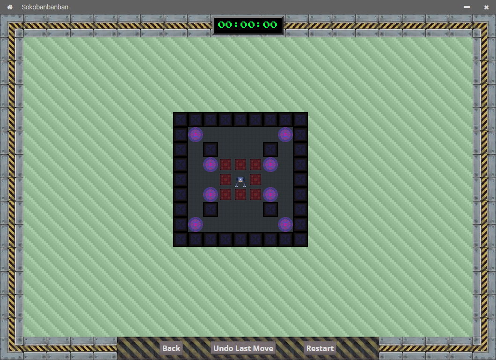

<!-- TODO: #7 dodać angielskie komentarze -->

# Sokobanbanban

*Projekt "Sokoban" na Motorola Science Cup 2020*  
*"Sokoban" Project for Motorola Science Cup 2020*

Dokumentacja Użytkownika  
User Documentation

Dokumentacja Techniczna jest w pliku /
Technical Documentation is in
[TECH-DOC.md](./TECH-DOC.md)

## 1. Najnowsza stabilna wersja / Newest stable version: <u style="font-size: 2.5rem">3.0.0</u>

## 2. Zakon Technomantów

* Wielki Mistrz (Kapitan) / Grand Master (Team Leader): **Iwo Strzeboński**
* i pozostali Bracia (Członkowie) / and other Brethren (Members):
  * **Igor Kaliciński**
  * **Jan Krzemień**
  * **Zbyszko Sobecki**
  * **Wojciech Orłowski**

## 3. Autorzy / Authors

* **Iwo Strzeboński**:
  * Projektowanie wyglądu interfejsu graficznego / GUI Design
  * Różne tryby / Level Modes
  * Poziomy trudności map / Map Difficulty
  * Dokumentacja / Documentation
* **Igor Kaliciński**:
  * Edytor poziomów / Level Editor
  * Hala Sław / Hall of Fame
  * Zapisy gier / Save Slots

## 4. Licencja

[WTFPL by Sam Hocevar](./LICENSE)

## 5. Podziękowania / Credits

* **Laura Wheeler** -
twórczyni gry *Sokoban Junior 1*, skąd pochodzą mapy /
author of the *Sokoban Junior 1* game, from which maps in this game are from

## 6. Przygotowywanie środowiska do pracy / Preparing the environment to work

1. Zainstaluj / Install [Node.js]
2. Pobierz wymagane pakiety za pomocą polecenia: / Download required packages using:

```cmd
npm install
```

## 7. Praca na kodzie źródłowym / Working on the source code

Aby uruchomić program, należy w konsoli wpisać polecenie: / To start the program, you need to use that command in the command line:

```cmd
npm start
```

## 8. Budowanie Projektu / Building the Project

Do zbudowania projektu należy użyć pakietu ElectronForge, który także jest pobierany jako wymagany pakiet.  
To build the project you should use the ElectronForge package, which is also downloaded as a required dependency.

```cmd
npx @electron-forge/cli import
npm run make
```

Zbudowanie Projektu **NIE** jest wymagane do uruchomienia go!  
Building the Project is **NOT** required in order to launch it!

[Node.js]:https://nodejs.org/en/download/

## 9. Rozgrywka / Game

### 1. Poruszanie się w grze / In-game movement


* Przyciski / Buttons:
  * `Save` zapisuje rozgrywkę
  (dostępny wyłącznie w II Module)  

  * `Surrender` poddaje rozgrywkę i zapisuje wynik do Hali Sław
  (dostępny wyłącznie w II Module)  

  * `Back` cofa do poprzedniej strony  

  * `Undo Last Move` cofa ostatni ruch

  * `Restart` ustawia gracza i skrzynie na pozycjach pierwotnych

* Obsługa klawiatury / Keyboard events:
  * `W` lub `Strzałka do góry` porusza gracza do góry

  * `A` lub `Strzałka w lewo` porusza gracza w lewo

  * `S` lub `Strzałka w dół` porusza gracza w dół

  * `D` lub `Strzałka w prawo` porusza gracza w prawo

  * `R` ustawia gracza i skrzynie na pozycjach pierwotnych

### 2. Tworzenie map / Creating levels

### 3. Menu Główne / Main Menu


* Przycisk oznaczony pojedynczą poziomą kreską służy do minimalizowania programu.  

* Przycisk oznaczony symbolem krzyżyka służy do zamykania programu.  

* Przycisk `Play` służy do uruchamiania Modułu I -
map podzielonych na poziomy trudności.  

* Przycisk `Load/Start new game` służy do uruchamiania Modułu II -
map o rosnącym poziomie trudności.  

* Przycisk `Custom game` służy do uruchamiania Modułu III -
mapy stworzonej w Edytorze Map.  

* Przycisk `Create level` służy do uruchamiania Modułu III - edytora map.  

* Przycisk `Hall of Fame` służy do uruchamiania Modułu II -
sprawdzania listy wyników trybu o rosnącym poziomie trudności.

* Przycisk `Credits` przenosi do strony z informacjami
o Autorach oraz podziękowaniach.  

* Przycisk `Quit` zamyka grę.  

### 2. Moduł I - Poziomy Trudności / Module I - Difficulty Levels


* Przycisk oznaczony symbolem domu służy do powrotu na Stronę Główną.  

* Przycisk `Back` cofa do poprzedniej strony.  

* Przycisk `Easy` uruchamia losową Łatwą mapę.  



* Przycisk `Medium` uruchamia losową Średnio Trudną mapę.  


* Przycisk `Hard` uruchamia losową Trudną mapę.  


### 3. Moduł II - Rosnący Poziom Trudności / Module II - Ascending Mode


* Przyciski opisane kolejno `Save 1`, `Save 2` i `Save 3` to kolejne zapisy gry.
Gracz ma do dyspozycji wyłącznie trzy miejsca na zapisy.  

  Naciśnięcie dowolnego przycisku zapisu uruchamia grę na mapie,
  która jest w danym zapisie. Jeśli nie ma pliku zapisu, to jest on tworzony
  i jest do niego wczytywana pierwsza mapa Trybu.  


